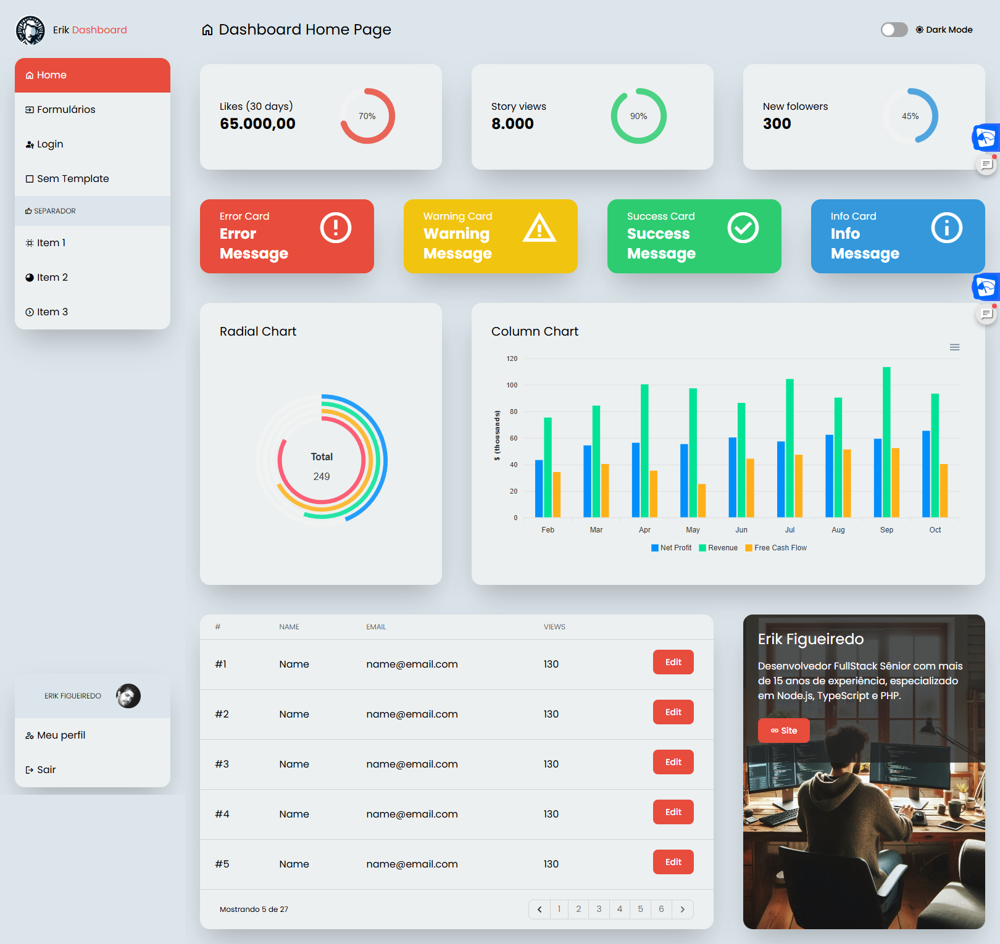

# Dashboard



## Descrição
Este é o projeto do Dashboard, uma aplicação front-end construída com React, Vite e Tailwind CSS. Ele consome componentes reutilizáveis do projeto `components` e utiliza uma arquitetura modular para facilitar a manutenção e escalabilidade.

## Iniciar um novo projeto

É possível iniciar o projeto do zero sem a necessidade de cloná-lo diretamente. Para isso, você pode usar o comando `npx` ou `yarn create` para criar o projeto a partir do repositório GitHub.

### Passos:
1. Certifique-se de que você tem o Node.js e o gerenciador de pacotes (npm ou yarn) instalados.
2. Execute o seguinte comando para criar o projeto diretamente do GitHub:
   ```bash
   npx degit erikfigueiredo/my-dashboard-base#dashboard my-dashboard
   ```
   ou, se estiver usando yarn:
   ```bash
   yarn create degit erikfigueiredo/my-dashboard-base#dashboard my-dashboard
   ```
3. Navegue até o diretório do projeto:
   ```bash
   cd my-dashboard
   ```
4. Instale as dependências:
   ```bash
   yarn install
   ```
5. Configure o arquivo `.env` com a variável `VITE_BASE_APP` para definir o subdiretório base.
6. Execute o servidor de desenvolvimento:
   ```bash
   yarn dev
   ```

## Estrutura do Projeto
- **public/**: Contém arquivos estáticos como imagens e o arquivo `index.html`.
- **src/**: Contém o código-fonte principal, incluindo:
  - **components/**: Componentes específicos do dashboard.
  - **config/**: Configurações como rotas.
  - **contexts/**: Contextos globais, como o modo escuro.
  - **hooks/**: Hooks personalizados.
  - **layouts/**: Layouts reutilizáveis.
  - **mock/**: Dados e gráficos simulados.
  - **pages/**: Páginas principais da aplicação.
  - **router/**: Configuração do roteador.
  - **utils/**: Funções utilitárias.

## Configuração e Execução
1. Instale as dependências:
   ```bash
   yarn install
   ```
2. Configure o arquivo `.env` com a variável `VITE_BASE_APP` para definir o subdiretório base.
3. Execute o servidor de desenvolvimento:
   ```bash
   yarn dev
   ```
4. Para construir o projeto para produção:
   ```bash
   yarn build
   ```

## Dependências Principais
- React
- Vite
- Tailwind CSS
- React Router
- ApexCharts

## Scripts Disponíveis
- `yarn dev`: Inicia o servidor de desenvolvimento.
- `yarn build`: Gera a build de produção.
- `yarn preview`: Visualiza a build de produção.
- `yarn lint`: Executa o linter.
- `yarn test`: Executa os testes.

## Dependência: @components

O projeto utiliza o pacote `@components`, disponível no repositório [my-dashboard-components](https://github.com/erikfig/my-dashboard-components). Este pacote fornece uma coleção de componentes reutilizáveis, como botões, tabelas, gráficos e muito mais, projetados para serem integrados facilmente ao dashboard.

Para instalar ou atualizar a dependência, certifique-se de que o `package.json` está configurado corretamente:
```json
"dependencies": {
  "@components": "github:erikfigueiredo/my-dashboard-base#components"
}
```

O pacote é automaticamente buildado ao ser instalado, garantindo que a versão mais recente esteja disponível para uso.
